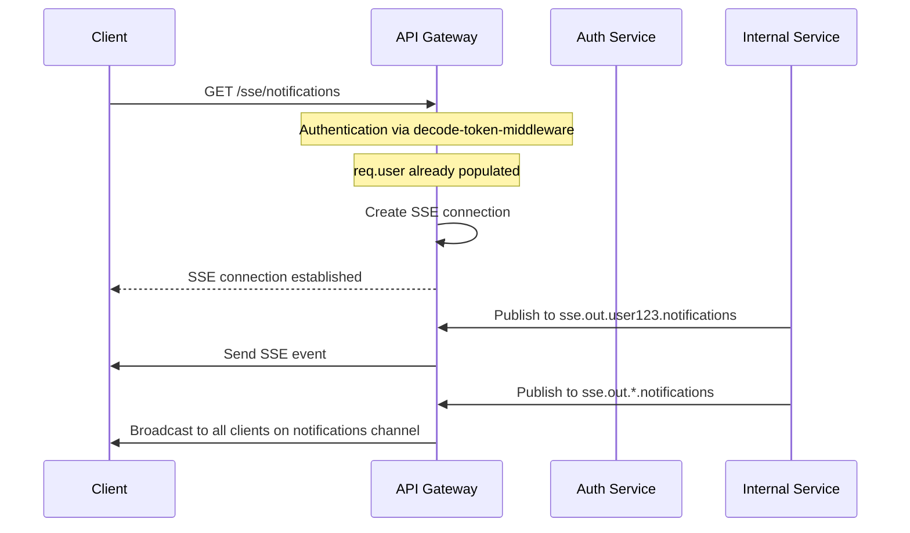

# Server-Sent Events (SSE) Implementation

This document describes the Server-Sent Events (SSE) implementation added to the Fruster API Gateway.

## Overview

Server-Sent Events (SSE) is a server push technology enabling a client to receive automatic updates from a server via an HTTP connection. The SSE implementation in Fruster API Gateway allows:

1. Clients to establish persistent connections to specific channels
2. Internal services to publish events to specific users or broadcast to all users
3. Authentication using the existing JWT token mechanism (required for all SSE connections)
4. Simple JSON data format for events

> **Note:** SSE functionality is **disabled by default** and requires explicit configuration to enable it. This allows for more aggressive testing and release without affecting existing functionality.

## Architecture

The SSE implementation follows a similar pattern to the existing WebSocket implementation:



## Implementation Components

### 1. FrusterSSEManager

The core component that manages SSE connections, handles authentication, and forwards events to connected clients. Located at `lib/sse/FrusterSSEManager.js`.

### 2. Configuration

SSE-specific configuration options in `conf.js`:

```javascript
// Enable Server-Sent Events (SSE) functionality
// Default: false (disabled)
enableSSE: true,

// Subject pattern for SSE events
sseSubject: "sse.out.:userId.>",

// Maximum number of SSE connections per user
maxSSEConnectionsPerUser: 10,

// SSE heartbeat interval
sseHeartbeatInterval: ms("30s"),
```

To enable SSE functionality, you must set `enableSSE: true` in your configuration or set the environment variable `ENABLE_SSE=true`.

### 3. Integration

The SSE manager is initialized in `app.js` alongside the WebBus.

## Usage

### Client-Side

Clients can connect to SSE channels using the standard EventSource API:

```javascript
const eventSource = new EventSource("/sse/notifications");

eventSource.onmessage = function (event) {
	const data = JSON.parse(event.data);
	console.log("Received event:", data);
};

eventSource.onerror = function (error) {
	console.error("SSE connection error:", error);
};

// Close the connection when needed
function closeConnection() {
	eventSource.close();
}
```

### Server-Side

Internal services can publish events to SSE channels using the bus mechanism:

```javascript
// Send to specific user
bus.publish(`sse.out.user123.notifications`, {
	data: {
		type: "notification",
		message: "You have a new message",
	},
});

// Broadcast to all users on a channel
bus.publish(`sse.out.*.system-alerts`, {
	data: {
		type: "alert",
		message: "System maintenance in 10 minutes",
	},
});
```

## Examples

Example files demonstrating the SSE functionality are available in the `examples/sse` directory:

-   `sse-demo.html`: A simple HTML page that demonstrates how to connect to SSE endpoints and receive events
-   `sse-routes.js`: Example routes for serving the demo page and providing an API endpoint to publish events
-   `README.md`: Detailed instructions on how to use the examples

## Deployment Considerations

1. **Scaling**: SSE connections are stateful and require sticky sessions if deployed behind a load balancer
2. **Monitoring**: Add metrics for active connections and event throughput
3. **Security**: Ensure proper authentication and consider rate limiting

## Future Enhancements

1. **Connection Limits**: Implement per-user and global connection limits
2. **Event Filtering**: Allow clients to specify event filters
3. **Reconnection Tokens**: Implement event IDs and last-event-id header support for reliable reconnection
4. **Channel Authorization**: Add channel-specific authorization rules
